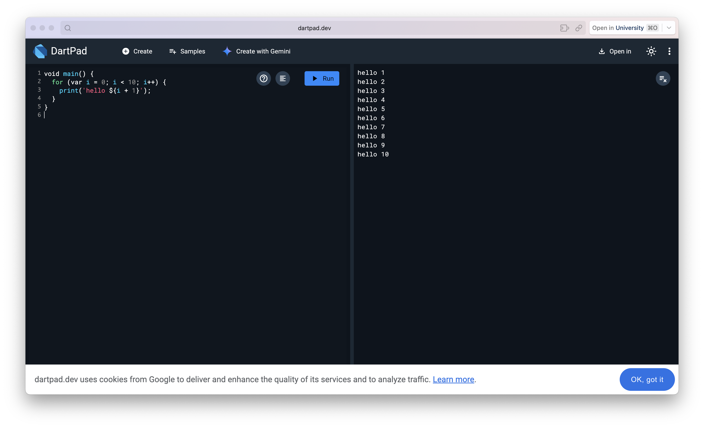
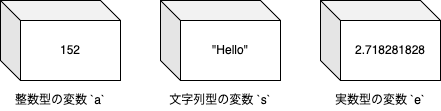
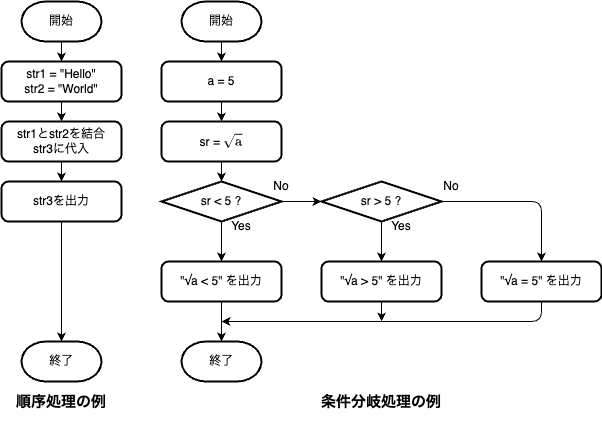
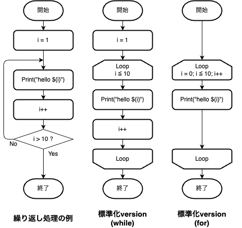
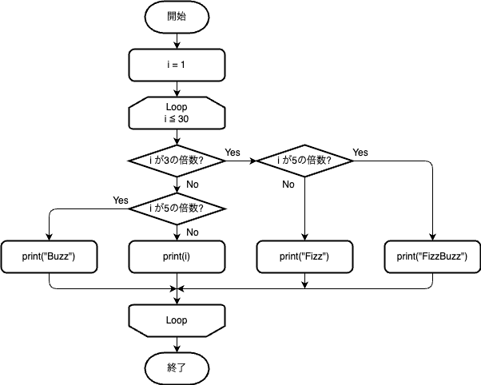

# Ex1. Hello Dart programming World!

この章では、プログラミングでの基本的な概念を押さえます。
また、既にプログラミングの基礎に触れたことのある方は Dart 言語としての文法を学んでいただきます。

## Contents

1. [始める前に](#始める前に)
2. [全ての始まり「Hello world」](#全ての始まりhello-world)
3. [データの入る箱「変数」](#データの入る箱変数)
4. [条件分岐と繰り返し](#条件分岐と繰り返し)
5. [References （有用なサイト・チートシート）](#references)

## 始める前に

本来プログラミングは、プログラム（以下コード）を編集し実行するためのアプリケーション（エディタ・コンパイラ・インタプリタやそれらを統合した IDE）が必要です。
最終的にアプリを作る上でそれらのアプリを用意する「環境構築」が必要なのですが、今は簡単なコードであれば Web サイト上でプログラミングができる時代です。

まずは、自分の PC で[DartPad](https://dartpad.dev/)を開き、そこで試してみましょう。

最初はこのような画面になっていると思います。



画面左半分がエディタ（コードを打つ場所）、右半分が出力（実行結果が表示される場所）になります。

## 全ての始まり「Hello world」

おそらく DartPad には最初からコードが書き込まれているかもしれませんが、以下のコードに書き換えてください。
コピー＆ペーストでも大丈夫ですが、この規模のコードは自分で打ち込んで慣れた方がいいと思います。

```dart
void main() {
  print("Hello World!");
}
```

`Run`を押して実行してみてください。右半分の出力画面に`"Hello World!"`が現れたら成功です！

> [!TIP]
>
> 新しいプログラミング言語を学び始めた人は、ほとんどの人がこの「Hello world」を画面に表示するところから始めるのです。

簡単なコードの解説です。

- `void main() {}`は、ブラケット`{}`の内側がプログラムの処理内容であることをコンピュータ側に示しています(詳細は割愛)。
- `print()`は、カッコ`()`の内側の`""`で囲まれた文字列を表示する機能を持ちます。これを「print 関数」と呼びます。
- 一般的なプログラムは、「関数」の組み合わせで構成されています。数学の関数とは異なりますが、似ている点もあります。
- 関数の終わりには、`;`をつけます。一部のプログラミング言語ではつける必要があるのですが、忘れがちです。

## データの入る箱「変数」

ここから、少しずつプログラミングらしくなっていきます。
まず、「変数」(Variable)を覚えましょう。
変数は、よく「データの入る箱」に例えられます。



変数には、プログラム中で使用するデータを記憶させることができます。
データ型には多くの種類があるのですが、まず基本の 3 つを知っておきましょう。

|   型   |  コード中の宣言   |          値の例           |
| :----: | :---------------: | :-----------------------: |
|  整数  |       `int`       |    `100`, `320`, `-70`    |
|  実数  | `float`, `double` |      `3.14`, `6.34`       |
| 文字列 |     `String`      | `"Text"`, `"Programming"` |

> [!NOTE]
>
> - `String`のみ、先頭が大文字です。
> - `float`, `double`は、扱える値の範囲が違います。理由がなければ範囲の広い`double`を使いましょう。

ちなみに、単に「123」という数字も、数値として解釈するか、文字列として解釈するかで物事が異なります。
これから、数値は単純に`123`、文字列なら`"123"`と表記することにします。

### 変数を作る

では、実際に変数を使ってみます。コピー＆ペーストもしくは直打ちをして、`Run`してみましょう。

```dart
void main() {
  /* 変数の宣言
  int型 `a`
  String型 `s`
  double型 `e`
  int型 `t` (初期値なし)
  */
  int a = 123;
  String s = "Hello";
  double e = 2.718281828;
  int t;

  // 変数の中身を表示
  print(a);
  print(s);
  print(e);

  // tの代入1
  t = a;
  print(t);

  // tの代入2
  t = 500;
  print(t);
}
```

コード解説です。ちなみに、処理は基本的に上から順番に実行されます。

- コード中の`/* 文字列 */`や`// 文字列`は「コメント（注釈）」と呼ばれます。この部分はメモと認識され、実行には影響しません。
  - 前者は、`/*`と`*/`に囲まれた区間がコメントになり、複数行やコードの合間（あまり推奨しませんが）でも使えます。
  - 後者は、`//`の右側が全てコメントになります。こちらの方が使用頻度は高いです。
- 「変数の宣言」では、変数（箱）を新規作成します。
  - `変数型 変数名 (= 初期値)`で作成できます。
  - 初期値を設定せずに空の箱を作ることもできます。
- 「変数の中身を表示」では、print 関数で中身を確認できます。最初の 3 つの出力がコードの値と同じことを確認しましょう。
- 「`t`の代入」では、コードの途中で値を代入（書き換え）しています。その後の print 関数の出力がコード通りか確かめましょう。

### 変数を使って計算する

それでは、ここで簡単な計算をしてみましょう。

```dart
void main() {
  // 変数宣言
  int a = 15, b = 6; // `,`で区切れば、複数宣言できる

  // 計算
  int add = a + b;
  int mul=a*b; // スペースなしでも動作する

  // 結果出力
  print("${a} + ${b} = ${add}"); // "15 + 6 = 21"
  print("${a} * ${b} = ${mul}"); // "15 * 6 = 90"
}
```

コード解説です。途中のコメントと合わせて確認してください。

- 「計算」では、`a + b`を`add`に、`a×b`を`mul`に代入しています。
- 「結果出力」では、計算結果を表示しているのですが、`"${変数名}"`とすることで文字列中に変数を埋め込むことができます。
  出力結果はコードのコメントの通りになるはずです。

基本的な演算記号は以下のとおりです。

|          演算          | コード中の演算子 |
| :--------------------: | :--------------: |
|          加算          |       `+`        |
|          減算          |       `-`        |
|          乗算          |       `*`        |
|          除算          |       `/`        |
| 除算（余りを含まない） |       `~/`       |
|      剰余（余り）      |       `%`        |

> [!TIP]
>
> なお、代入した変数（`add`/`mul`のようなもの）をそれ以降のプログラムで多用しないのであれば、`"${a+b}"`のように埋め込み内での計算もできます。

### Advances

ここで詳細には紹介しない内容もあります。なくてもやりたいことは実現しますが、使うと便利な物もありますので余裕があれば調べてみましょう。

- 定数 `const`
- 代入演算子 `+=`, `*=` etc.

## 条件分岐と繰り返し

プログラムは上から下に向かって処理をするのが基本ですが、発展した処理を行うには「条件分岐」と「繰り返し」という制御構造が有用です。

### 条件分岐

変数の状態などによって、特殊な処理を行なったり、処理の内容を変えることができます。これを「条件分岐」と言います。
フローチャート（流れ図）で表すと、このようになります。



では、変数に入っている整数が、奇数か偶数かを判別するプログラムを考えてみましょう。

```dart
void main() {
  int a = -13;

  if ((a % 2) == 1) {
    print("${a} は奇数");
  } else {
    print("${a} は偶数");
  }
}
```

コード解説です。

- まずは、偶奇判定の方法（アルゴリズム）ですが、判定する数値を 2 で割った余りが 0 か 1 かで判定することができます。余りが 1 なら奇数です。
- `if (条件式)`が、判定する部分です。ここでは、`a % 2`（a÷2 の余り）が 1 かどうかを判定しています。数学と同様、`()`で囲まれているとその内側が優先されます。
- `左辺 == 右辺`で、等しいかどうかが判定されます。ここで`=`ではないことに注意してください。`=`は変数への代入を示す記号です。
- 条件を満たしている場合、`{}`の中の処理が実行されます。複数行の処理も実行されます。
- 条件を満たさない場合、`else {}`の処理が実行されます。なお、この部分は省略することができます。

なお、`==`以外の判定も存在します。

| 判定方法 | コードでの記述 |
| :------: | :------------: |
|    ＝    |      `==`      |
|    ≠     |      `!=`      |
|    ＜    |      `<`       |
|    ＞    |      `>`       |
|    ≦     |      `<=`      |
|    ≧     |      `>=`      |

条件分岐の発展例です。

```dart
if (v > 0) {
    print("正の数");
} else if (v < 0) { // 「`v > 0`でなかった」けど、「`v < 0`ではある」場合の分岐。
    print("負の数");
} else {
    print("ゼロ");
}

if ((v == 1) || (v == 10)) { // `||`を使うと、どちらかを満たす時に条件を満たす。
  print("vは1か10");
}

if ((v > 1) && (v < 10)) { // `&&`を使うと、どちらも満たす時に条件を満たす。
  print("1 < v < 10");
} else {
  print("v ≦ 1 または v ≧ 10");
}

/*
 * `!`を使うと、YesとNoが逆転する。
 * `!`の右の式の条件が満たされる場合は満たされないものとされ、
 * 逆に満たされない場合は満たされるものと扱う。
 */
if (!(v > 10)) {
    print("v > 10 ではない");
}
```

後ろの 3 つは、数学の「集合」に似ています。複数の変数の状態で、細かく分岐することができます。

### 繰り返し

変数の状態などによって、一部の処理を繰り返させることができます。これを「繰り返し」と言います。
フローチャート（流れ図）で表すと、このようになります。



- `i++`は、`i = i + 1`と同じ意味です。`i`に 1 を加算して、再び代入します。（数学的には不適切ですが...）
- 同様に、`i--`も存在します。こちらは`i`を 1 減らします。
- それぞれ、「インクリメント」「デクリメント」と呼ばれます。

では、プログラムです。`i` の値とともに、10 回`"hello"`と出力されます。

```dart
void main() {
  int i = 1;
  while (i <= 10) {
    print("hello ${i}");
    i++;
  }
}
```

- `while ()`のカッコ内の条件が満たされると、下の`{}`内の処理が実行され、その後`while ()`に「戻ります」。
- 戻った後も、条件を判定します。条件を満たさなくなると、`{}`の処理をスキップします。

### 制御構造のネスト（入れ子）

条件分岐と繰り返しを利用したプログラムとして、「FizzBuzz」があります。
英語圏の子供達の言葉遊びで、

- 1 から順にカウントして数字を言う
- 3 の倍数なら数字の代わりに「Fizz」と言う
- 5 の倍数なら数字の代わりに「Buzz」と言う
- 3 の倍数かつ 5 の倍数（15 の倍数）なら数字の代わりに「FizzBuzz」と言う

```dart
void main() {
  int i = 1;
  while (i <= 30) {
    if ((i % 3) == 0) {
      if ((i % 5) == 0) {
        print("FizzBuzz");
      } else {
        print("Fizz");
      }
    } else if ((i % 5) == 0) {
      print("Buzz");
    } else {
      print(i);
    }
    i++;
  }
}
```

これがプログラムです。これを見ればわかると思いますが、`while`/`if`のブラケット`{}`内にも、さらに`while`/`if`文を使用することができます。

少し複雑なので、フローチャートを示します。



> [!IMPORTANT]
>
> 今までのコードでも当たり前のように行なっていたのですが、ブラケット`{}`内のコードは、その前後のコードより 2~4 文字程度右に文字の初めをずらす
> **インデント（字下げ）**をするように心がけましょう。文字を詰めず適切なインデントをすることで、コードが見やすくなります。

> [!NOTE]
>
> 正しい動作をする FizzBuzz コードは、これ以外にも複数存在します。
> 様々な正解を模索してみましょう。

### Advances

**三項演算子**

```dart
str1 = (a == 5) ? "aは5" : "aは5でない";

// 場合によっては読みにくいが、こういったことも可能
str2 = (b != 0) ? ((b > 0) ? "bは正" : "bは負") : "bは0";
```

条件式の内容で、代入する変数を変えられます。
単純な分岐かつ 1 変数の代入しかしない場合は、これでコードが読みやすくなります。

**`for` 文**

```dart
void main() {
  for (int i = 1; i <= 10; i++) {
    print("hello ${i}");
  }
}
```

繰り返す回数が決まっている場合は、こちらがよく利用されます。
`for()`のカッコ内で、

- 繰り返しに使う変数の宣言
- 繰り返し条件
- ループサイクルの最後に実行するカウントアップ（ダウン）

を`;`でまとめて記述します。

**`do-while`文**
優先度は低いです。（`for`/`while`のみで完結する場合がほとんどです）詳細は省きます。

## References

[【Dart / Flutter】演算子まとめ (Qiita)](https://qiita.com/suga_slj/items/3dea894f03d92d59bb35)
